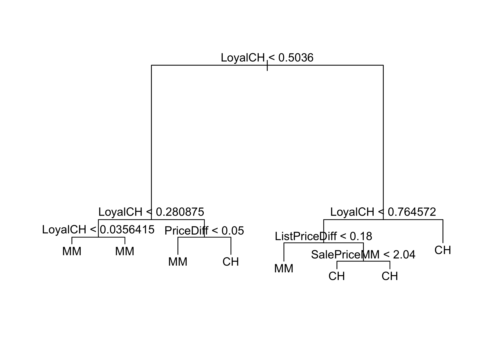
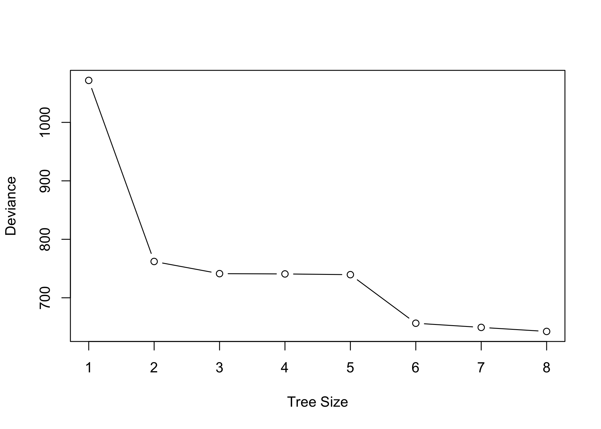
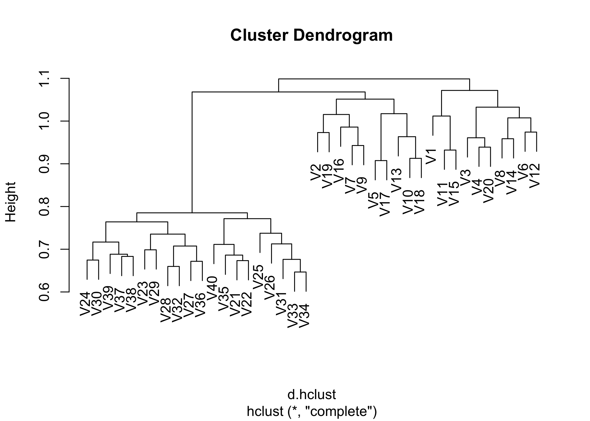
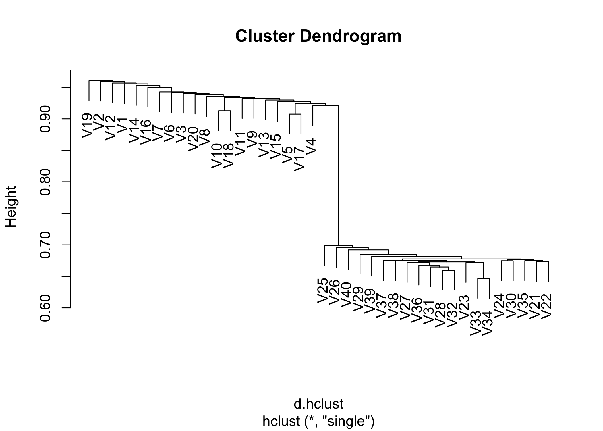
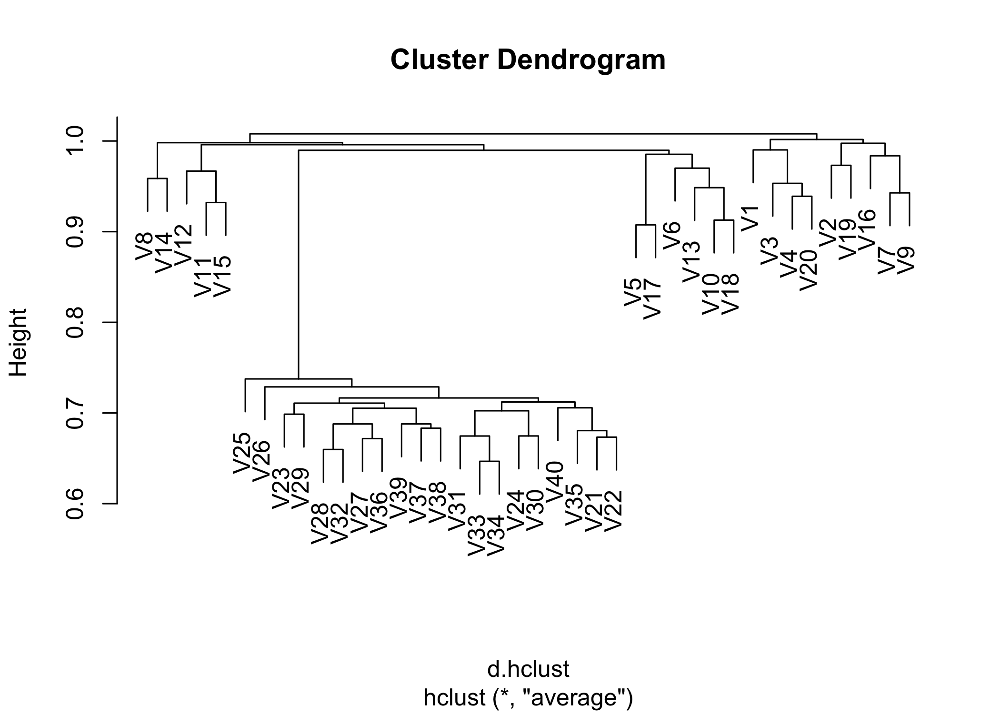

1. Suppose we produce ten bootstrapped smaples from a data set containing red and green classes. We then apply a classification tree to each bootstrapped sample and, for a specific value of X, produce 10 estimates of P(Class is Red|X):
-------------------------------------------------------------------------------------------------------------------------------------------------------------------------------------------------------------------------------------------

0.1, 0.15, 0.2, 0.2, 0.55, 0.6, 0.6, 0.65, 0.7, 0.75

There are two common ways to combine these results together into a single class prediction. One is the majority vote approach discussed in this chapter. The second approach is to classify based on the average probability. In this example, what is the final classification under each of these two approaches?
-------------------------------------------------------------------------------------------------------------------------------------------------------------------------------------------------------------------------------------------------------------------------------------------------------------------

-   For majority vote approach, we have 6 voted for red and 4 voted for
    green, so the final classification will be red.

-   For average probability approach, we have p = 0.45, so the final
    classification will be green.

2. This problem involves the OJ data set which is part of the ISLR package.
---------------------------------------------------------------------------

### (a) Create a training set containing a random sample of 800 observations, and a test set containing the remaining observations.

### (b) Fit a tree to the training data, with Purchase as the response and the other variables as predictors. Use the `summary()` function to produce summary statistics about the tree, and describe the results obtained. What is the training error rate? How many terminal nodes does the tree have?

    Classification tree:
    tree(formula = Purchase ~ ., data = Train)
    Variables actually used in tree construction:
    [1] "LoyalCH"       "PriceDiff"     "ListPriceDiff" "SalePriceMM"  
    Number of terminal nodes:  8 
    Residual mean deviance:  0.7235 = 573 / 792 
    Misclassification error rate: 0.1588 = 127 / 800 

The tree only uses 4 variables: `LoyalCH`, `PriceDiff`, `ListPriceDiff`
and `SalePriceMM`. The training error rate (miss classification rate) is
0.159. The tree has 8 terminal nodes.

### (c) Type in the name of the tree object in order to get a detailed text output. Pick one of the terminal nodes, and interpret the information displayed.

    node), split, n, deviance, yval, (yprob)
          * denotes terminal node

     1) root 800 1070.00 CH ( 0.61000 0.39000 )  
       2) LoyalCH < 0.5036 355  420.20 MM ( 0.27887 0.72113 )  
         4) LoyalCH < 0.280875 167  130.20 MM ( 0.13174 0.86826 )  
           8) LoyalCH < 0.0356415 59   10.14 MM ( 0.01695 0.98305 ) *
           9) LoyalCH > 0.0356415 108  106.40 MM ( 0.19444 0.80556 ) *
         5) LoyalCH > 0.280875 188  254.40 MM ( 0.40957 0.59043 )  
          10) PriceDiff < 0.05 81   74.58 MM ( 0.17284 0.82716 ) *
          11) PriceDiff > 0.05 107  144.90 CH ( 0.58879 0.41121 ) *
       3) LoyalCH > 0.5036 445  336.80 CH ( 0.87416 0.12584 )  
         6) LoyalCH < 0.764572 180  204.60 CH ( 0.74444 0.25556 )  
          12) ListPriceDiff < 0.18 49   66.27 MM ( 0.40816 0.59184 ) *
          13) ListPriceDiff > 0.18 131  101.10 CH ( 0.87023 0.12977 )  
            26) SalePriceMM < 2.04 51   59.94 CH ( 0.72549 0.27451 ) *
            27) SalePriceMM > 2.04 80   25.59 CH ( 0.96250 0.03750 ) *
         7) LoyalCH > 0.764572 265   85.16 CH ( 0.96226 0.03774 ) *

For example, we picked up the terminal node (11), the splitting variable
at this node is `PriceDiff`, the splitting value is 0.05. There are 107
points in the subtree below this node. The deviance for all points
contained in region below this node is 144.90. The prediction at this
node is `Purchase = CH`. About 58.9% points in this node have
`Purchase = CH` and about 41.1% points in this node have
`Purchase = MM`.

### (d) Create a plot of the tree, and interpret the results.

`LoyalCH` may be the most important variable here, when `LoyalCH` &lt;
0.0356415 the tree predicts `Purchase = MM` and when `LoyalCH` &gt;
0.764572 the tree predicts `Purchase = CH`. For intermediate value of
`LoyalCH` between 0.0356415 and 0.764572, the prediction also depends on
variable `PriceDiff`, `ListPriceDiff` and `SalePriceMM`.

### (e) Predict the response on the test data, and produce a confusion matrix comparing the test labels to the predicted test labels. What is the test error rate?

        pred.tree
          CH  MM
      CH 142  23
      MM  36  69

The test error rate is 0.219.

### (f) Apply the `cv.tree()` function to the training set in order to determine the optimal tree size.

### (g) Produce a plot with tree size on the x-axis and cross-validated classification error rate on the y-axis.

### (h) Which tree size corresponds to the lowest cross-validated classification error rate?

We can't decide based on the plot, because the CV classification error
rate decreases through tree size.

### (i) Produce a pruned tree corresponding to the optimal tree size obtained using cross-validation. If cross-validation does not lead to selection of a pruned tree, then create a pruned tree with five terminal nodes.

    Classification tree:
    snip.tree(tree = fit.tree, nodes = c(4L, 13L, 5L))
    Variables actually used in tree construction:
    [1] "LoyalCH"       "ListPriceDiff"
    Number of terminal nodes:  5 
    Residual mean deviance:  0.8014 = 637.1 / 795 
    Misclassification error rate: 0.1825 = 146 / 800 

### (j) Compare the training error rates between the pruned and unpruned trees. Which is higher?

Misclassification error of pruned tree is higher than that of original
tree.

### (k) Compare the test error rates between the pruned and unpruned trees. Which is higher?

So the test error rates for pruned tree is 0.233, which is higher than
the unpruned tree

3. On the book website, www.StatLearning.com, there is a gene expression data set (`Ch10Ex11.csv`) that consists of 40 tissue samples with measurements on 1,000 genes. The first 20 samples are from healthy patients, while the second 20 are from a diseased group.
----------------------------------------------------------------------------------------------------------------------------------------------------------------------------------------------------------------------------------------------------------------------

### (a) Load in the data using `read.csv()`. You will need to select `header=F`.

### (b) Apply hierarchical clustering to the samples using correlation-based distance, and plot the dendrogram. Do the genes separate the samples into the two groups? Do your results depend on the type of linkage used?

Not necessarily seperate into two groups. Yes, the result depends on the
type of `linkage`.

### (c) Your collaborator wants to know which genes differ the most across the two groups. Suggest a way to answer this question, and apply it here.

We could use PCA to determine which genes are used to describe the
variance the most.

                  PC1          PC2          PC3          PC4          PC5
    [1,] -0.002434664 -0.030745799  0.009359932  0.009699551 -0.012847866
    [2,] -0.002016598 -0.025927592  0.050300983 -0.026082885  0.003488293
    [3,]  0.011233842 -0.003937802  0.014564920  0.054373032 -0.020411836
    [4,]  0.013912855  0.025625408  0.033998676 -0.011530298 -0.009364524
    [5,]  0.007293322  0.013590353 -0.008229702 -0.001343010  0.030002978
    [6,]  0.017928318 -0.026302699 -0.020728401 -0.024069152 -0.018619253
                  PC6          PC7          PC8          PC9         PC10
    [1,]  0.023439995  0.010152261 -0.024602570 -0.021925557 -0.035003076
    [2,]  0.001605492 -0.037364376 -0.017332292  0.011319311  0.007802611
    [3,]  0.025337127  0.070772412  0.047340581 -0.013963868  0.023624407
    [4,]  0.029529539  0.002885764 -0.093667774 -0.008391226 -0.019226470
    [5,] -0.017042934  0.003555111 -0.053227214 -0.010479774  0.008446406
    [6,] -0.049103273 -0.040473304 -0.005455454 -0.003882692  0.028472950
                 PC11         PC12         PC13         PC14         PC15
    [1,]  0.068133070  0.002322824 -0.050042837 -0.043957087  0.007542896
    [2,] -0.092523227  0.036265781  0.002951734  0.021272662 -0.040075267
    [3,]  0.017649621  0.021512568  0.013587072  0.005264628 -0.002918920
    [4,]  0.006695624  0.025918069 -0.081179098  0.017689681  0.045951951
    [5,]  0.053250618 -0.076682641 -0.049516326 -0.003282028  0.060755699
    [6,] -0.018103035  0.015433035  0.015967833 -0.006985293 -0.025237500
                PC16         PC17        PC18         PC19         PC20
    [1,] -0.04567334 -0.019899716  0.02946561 -0.009362957 -0.029855408
    [2,]  0.03433259  0.003735211 -0.01218600 -0.023466062 -0.005495696
    [3,]  0.01881913  0.003284517  0.02597233  0.021581732  0.016808524
    [4,] -0.01062858  0.018342677 -0.03334608 -0.052262385 -0.030868339
    [5,] -0.02562691  0.049934804 -0.04221058 -0.012279815  0.018004932
    [6,] -0.00394582  0.037319024 -0.02541592 -0.029423771 -0.012043007
                 PC21          PC22         PC23         PC24         PC25
    [1,] -0.009190761  0.0230209664 -0.028970518  0.033060132  0.021453017
    [2,] -0.002808309  0.0079065160 -0.007921167 -0.034424716  0.011932971
    [3,]  0.010683143 -0.0392265342  0.004592080  0.026463736 -0.038085712
    [4,]  0.079419742 -0.0001627164  0.070396594 -0.002015954  0.006459925
    [5,] -0.038364004 -0.0230993500 -0.047439556 -0.001129421 -0.001285153
    [6,] -0.004522525  0.0304001071  0.016062043 -0.019329595 -0.034486284
                 PC26         PC27         PC28         PC29         PC30
    [1,]  0.034447853  0.017729906  0.034708970 -0.028136309 -0.009873440
    [2,]  0.051079165  0.032435028 -0.006934708 -0.026307151 -0.008143422
    [3,] -0.064720318 -0.004616608  0.038015189  0.006455198  0.004570640
    [4,]  0.022138389 -0.017120199  0.074901678  0.015812685  0.016391804
    [5,] -0.010772594  0.010889806 -0.005305488  0.015248277  0.029303828
    [6,]  0.001489549  0.028082907 -0.036617970 -0.054760935  0.023337598
                PC31         PC32        PC33          PC34        PC35
    [1,] -0.03576788  0.016708304 -0.01823350  0.0007957941 -0.01443692
    [2,] -0.04439239  0.011968530  0.04168309  0.0123210140  0.02739196
    [3,]  0.02932866  0.026066011  0.02055204 -0.0716448783  0.02726941
    [4,] -0.03954720  0.014714963  0.02846397  0.0316775643  0.01866774
    [5,]  0.05494446 -0.005416152  0.03476606  0.0245476439 -0.04037835
    [6,]  0.01132569  0.006320203 -0.00237484  0.0061140832  0.01402898
                 PC36         PC37         PC38          PC39        PC40
    [1,]  0.010652118 -0.009366629 -0.012754402  0.0020214363  0.07000786
    [2,] -0.002733484 -0.001318693  0.031410461 -0.0108377476 -0.06326465
    [3,]  0.020891497 -0.001380233 -0.025857254  0.0008800921 -0.32824953
    [4,] -0.027363133 -0.006080650 -0.025316130 -0.0235404170 -0.01675446
    [5,] -0.046869227 -0.017973802  0.002917167  0.0342753219  0.04896111
    [6,]  0.042083325  0.055817170 -0.010080327  0.0029965594  0.05407104

So the top 10 most different genes across two groups are 865, 68, 911,
428, 624, 11, 524, 803, 980, 822.

Appendix
--------

    knitr::opts_chunk$set(echo = FALSE, message = FALSE, warning = FALSE, comment = "")
    library(tidyverse)
    library(ISLR) # for OJ dataset
    library(tree)
    set.seed(100)

    # exercise 1
    x = c(0.1, 0.15, 0.2, 0.2, 0.55, 0.6, 0.6, 0.65, 0.7, 0.75)
    sum.red = sum(x >= 0.5)
    sum.green = sum(x < 0.5)
    x.mean = mean(x)

    # loading OJ data
    data(OJ)
    OJ = OJ %>% as_tibble()

    # train test split
    splitIndex = sample(nrow(OJ), 800, replace = F)
    Train = OJ[splitIndex,]
    Test = OJ[-splitIndex,]

    # modeling
    fit.tree <- tree(Purchase ~ ., data = Train)
    fit.sum <- summary(fit.tree)
    fit.sum

    # print the tree
    fit.tree

    # plot the tree
    plot(fit.tree)
    text(fit.tree, pretty = 0)

    # confusion matrix
    pred.tree = predict(fit.tree, Test, type = "class")
    table(Test$Purchase, pred.tree)

    # optimal tree size
    fit.tree.cv <- cv.tree(fit.tree, FUN = prune.tree)

    # plot tree size and CV error rate
    plot(fit.tree.cv$size, fit.tree.cv$dev, type = "b", xlab = "Tree Size", ylab = "Deviance")

    # pruned tree
    fit.tree.pruned <- prune.tree(fit.tree, best = 5)
    summary(fit.tree.pruned)

    # compare between pruned tree and unpruned tree
    pred.tree.pruned <- predict(fit.tree.pruned, Test, type = "class")

    # load Ch10Ex11.csv
    expre <- read.csv("Ch10Ex11.csv", header = F) %>% 
      as_tibble()

    # hierarchical clustering
    d.hclust <- as.dist(1 - cor(expre))
    plot(hclust(d.hclust, method = "complete"))
    plot(hclust(d.hclust, method = "single"))
    plot(hclust(d.hclust, method = "average"))

    # PCA
    pca.expre <- prcomp(t(expre))
    head(pca.expre$rotation)

    load.total <- apply(pca.expre$rotation, 1, sum)
    index <- order(abs(load.total), decreasing = T)
    top10 <- index[1:10]
